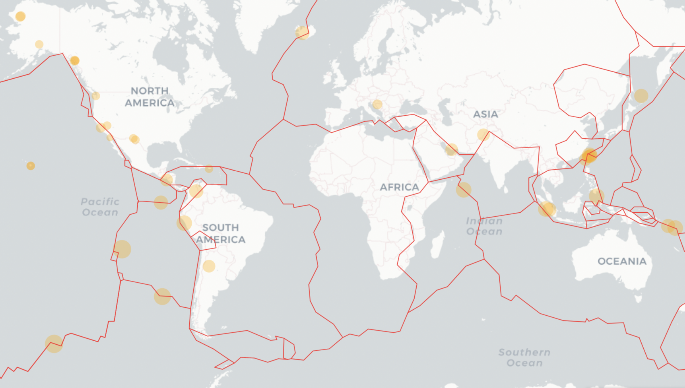
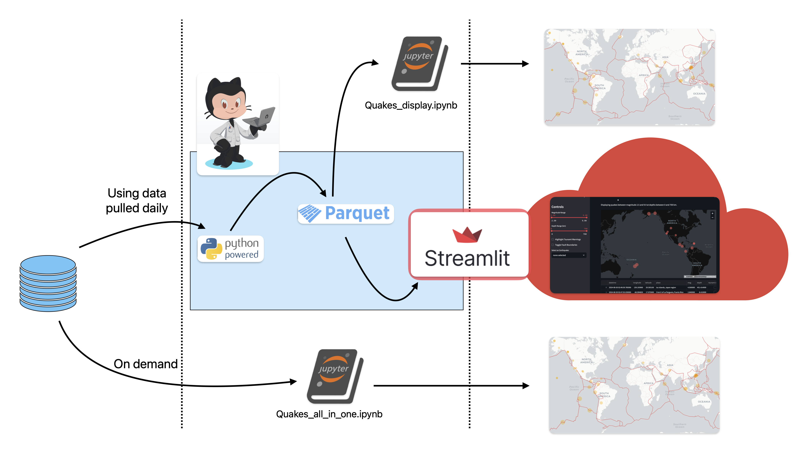

# 
Quakes

  

## Table of Contents

- [Top Image](#quakes)
- [Description](#description)
- [Background](#background)
- [Status](#status)
  

## Description

This project gets USGS data, cleans it, and displays it as either a:
<ol>
<li>Jupyter notebook. <code>Quakes_all_in_one.ipnb</code> is the most instructive, an all-in-one solution, and what generated the image above. It displays the map with Folium because I wanted to, as closely as possible, recreate the USGS site which uses Leaflet.JS, which Folium is based on. This notebook also pulls the data at the time of use in the event you have an earthquake watching emergency.</li></ol>

Fortunately, most folks don't have earthquake watching emergencies, and I could opt for pulling data once a day. So, at midnight, GMT, a GitHub action creates an ephemeral runner which runs <code>data_processing.py</code> which downloads USGS earthquake data. The data is already clean but needs to be transformed which the script also does. It then saves both a daily and aggregated version (for future use). Parquet is used for speed and compactness. That brings us to the two other ways of displaying the data.
  
<ol start="2">
<li>Streamilit app. <code>Quakes_app.py</code> is what Streamlit Cloud hosts and runs at https://quakes.streamlit.app/
<li>Jupyter notebook. <code>Quakes_display.ipynb</code> differs from the other jupyter notebook in where it gets it data from and it's currently the only one that displays the aggregated data.

</li></ol>

 

Or, put graphically:

  

## Background

A few years ago I started a makerspace with a group of really good folks. Along the way, we met an artist and instructor, [Christina Weisner](https://www.christinaweisner.com/about), who was in the early stages of doing a project and consulting with one of our members, Kerry Krauss. Kerry was a professor of electronics technology at the local community college.

According to Kerry, the code was a bit of kludge. It got the data from USGS somehow; I'm not sure if was RSS, Atom, or JSON. From there, the data was processed and sent a signal to a bunch of Arduino Uno boards ***by sound***. Each Arduino was used to actuate one of the seismometers Christina bought. That might seem nuts but Kerry's rationale was, since they were having to troubleshoot at each location, audio was easier to troubleshoot than whipping out a multimeter every time. You can see Christina & Kerry and learn more about her project [here](https://www.youtube.com/embed/uK_es620K0w).

What I liked about this project was how it blended art with technology. Even more interesting was one of the hydrophones was still functional so Christina (with some help) was able to make the observers part of the installation. Another thing I found interesting was the artist as a sort of conductor rather than as the sole author. Christina had the inspiration and idea for the project but almost all the most fabrication and technical aspects came from others.

[Top](#table-of-contents)

 

## Status

### 
 App functional with daily updates. Collecting data for next phase 

 

### 1 - Steps up to simple display

- [x] Pull JSON data from USGS of earthquakes greater than magnitude 2.5 over the last 24 hrs
- [x] Pipeline formatting of data
- [x] Display map of quakes >= 2.5 over last 24 hrs using Folium

### 2 -  Automate pipeline and Streamlit app

- [x] GitHub actions to automate update of data.
- [x] [Deploy app](https://quakes.streamlit.app/)

### 3 -  Pre-model development

- [x] Contact Eric Geist at [Tsunami and Earthquake Research](https://www.usgs.gov/centers/pcmsc/science/tsunami-and-earthquake-research?qt-science_center_objects=0#qt-science_center_objects) to see if there have been more tsunami occurrences
- [x] Get & massage data for tsunami warnings and actual tsunamis reported
- [ ] Contact Lisa Wald of USGS
- [ ] Get tsunami warning/occurrence data (working)

### 4 - Model development and display

- [ ] Develop model
- [ ] Twilio integration
- [ ] Find a way to export a photo as .png rather than as `quakes_last_24_hours.html` to update repo image at top daily. This is tricky because to do this for folium seem to require selenium and the formatting can be variable.
 

[Top](#table-of-contents)
